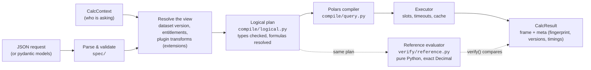

---
covers:
  - packages/calc/src/pylibs_calc/engine.py
  - packages/calc/src/pylibs_calc/compile/logical.py
  - packages/calc/src/pylibs_calc/exec.py
  - packages/calc/src/pylibs_calc/plugins.py
---

# Architecture

`pylibs-calc` is a **library**, not a service. Your service owns the data, the authentication and the HTTP layer. The engine turns a JSON request into a result that you can reproduce and check independently.

It has two layers: a **core engine** with the calculations every analytics service needs, and **[plugins](plugins.md)** that build analyses on top of it. What-if analysis is the [`pylibs-calc-whatif`](../whatif/index.md) plugin.

## The life of a request

1. **Parse.** The request is validated into pydantic models (`CalcRequest`, `Query`, …); old request versions are upgraded first. Formula strings such as `"price * quantity"` are parsed, safely and without `eval`, into expression trees.
2. **Resolve the view.** The engine finds the dataset version in the `Catalog` and applies the caller's `row_filter` and `allowed_columns`. Then each plugin transform named in `extensions` is bound, planned (and cached) and applied; the what-if transform, for example, loads a saved scenario and applies its steps.
3. **Plan.** The query is turned into a **logical plan**: typed expressions (with plugin functions and aggregates resolved), and the measures split into the aggregates they are computed from. All type errors are raised here, before any data is touched.
4. **Execute.** The Polars compiler turns the plan into a lazy query. The executor runs it within a concurrency slot and a deadline, and caches aggregates under the request's fingerprint.
5. **Describe.** The result's metadata records everything needed to reproduce it (see [Audit a number](../scenarios/audit.md)).

## Two evaluators, one plan

Every calculation is a logical plan executed by **two independent implementations**:

| | Polars compiler (`compile/`) | Reference evaluator (`verify/reference.py`) |
| --- | --- | --- |
| Purpose | Production speed | Correctness oracle |
| How | Lazy, multi-threaded Polars | Row by row, pure Python |
| Numbers | Polars `Decimal(38, s)` and `Float64` | Python `Decimal` |
| Used by | `run`, `compare`, `explain` | `verify()`, the property tests, canary jobs |

The semantics must stay identical, so any change to them updates both. `packages/calc/tests/test_property.py` fuzzes the two against each other with Hypothesis. Plugins follow the same rule: every function, aggregate and transform comes with a Polars and a Python implementation, and `pylibs_calc.testing` lets a plugin fuzz them the same way.

## The parts

| Part | Responsibility |
| --- | --- |
| `catalog` | Registers datasets (in-memory frames or lazily scanned files), normalizes types and checks keys |
| `spec/` | The request language: queries, requests, expressions, formula parser, canonical JSON, fingerprints and version upgrades |
| `compile/` | Validation and typing, logical planning, and compilation to Polars |
| `engine` | `CalcEngine`, the public façade (`run`, `compare`, `explain`, `distinct_values`, `call`, `plugin`), and `Kernel`, the machinery plugins build on |
| `plugins`, `ext` | The plugin API, and the building blocks plugins may use |
| `exec`, `cache` | Concurrency slots, timeouts, Polars runtime checks, result and plan caches |
| `verify/`, `testing` | Reference evaluator, `verify()`, invariants, and Hypothesis strategies |
| `adapters/aggrid` | Translates AG Grid's server-side row model to and from engine requests |
| `integrations/fastapi` | A ready-made router over the engine, extended by plugins' routes |

The what-if plugin (`packages/calc_whatif`) has the same shape on a smaller scale: `spec` (steps and the `whatif` block), `planner`, `polars` and `reference` (the two implementations of the steps), `scenario/` (manager, hash-chained log model, in-memory and Redis stores), `routes` and `aggrid` (cell edits).

For a map generated from the code itself (every module, its public classes and what it imports), see [Components](../reference/generated/components.md). That page is rebuilt from the code knowledge graph whenever the code changes.

## Design principles

- **Nothing is `eval`'d.** Formulas are parsed with a whitelist into trees.
- **A small core, extended by plugins.** The core has no notion of scenarios; plugins add them through the same public API a third party would use.
- **Every row is kept by what-if.** What-if steps change values, never which rows exist, so a scenario can always be compared with its base, row by row.
- **Explicit numerics.** Every decimal result has a defined scale and rounding mode. Floats and decimals never mix silently.
- **SQL null semantics** everywhere, in both evaluators.
- **Reproducible by construction.** The fingerprint covers everything that affects a result.
- **Extras stay optional.** `fastapi`, `redis` and `hypothesis` are imported only by the modules that need them.
