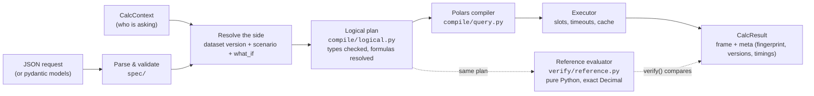

---
covers:
  - packages/calc/src/pylibs_calc/engine.py
  - packages/calc/src/pylibs_calc/compile/logical.py
  - packages/calc/src/pylibs_calc/exec.py
---

# Architecture

`pylibs-calc` is a **library**, not a service. Your service owns the data, the authentication and the HTTP layer. The engine turns a JSON request into a result that you can reproduce and check independently.

## The life of a request

1. **Parse.** The request is validated into pydantic models (`CalcRequest`, `Query`, `Shock`, …). Formula strings such as `"price * quantity"` are parsed, safely and without `eval`, into expression trees.
2. **Resolve the side.** The engine finds the dataset version in the `Catalog` and applies the caller's `row_filter` and `allowed_columns`. It then loads the saved scenario's steps at the requested version and appends the one-off `what_if` steps.
3. **Plan.** Everything is turned into a **logical plan**: typed expressions, the effective steps after disables, formulas in dependency order, and the measures split into the sums they are computed from. All type errors are raised here, before any data is touched.
4. **Execute.** The Polars compiler turns the plan into a lazy query. The executor runs it within a concurrency slot and a deadline, and caches aggregates under the request's fingerprint.
5. **Describe.** The result's metadata records everything needed to reproduce it (see [Audit a number](../scenarios/audit.md)).

## Two evaluators, one plan

Every calculation is a logical plan executed by **two independent implementations**:

| | Polars compiler (`compile/`) | Reference evaluator (`verify/reference.py`) |
| --- | --- | --- |
| Purpose | Production speed | Correctness oracle |
| How | Lazy, multi-threaded Polars | Row by row, pure Python |
| Numbers | Polars `Decimal(38, s)` and `Float64` | Python `Decimal` |
| Used by | `run`, `compare`, `explain` | `verify()`, the property tests, canary jobs |

The semantics must stay identical, so any change to them updates both. `packages/calc/tests/test_property.py` fuzzes the two against each other with Hypothesis.

## The parts

| Part | Responsibility |
| --- | --- |
| `catalog` | Registers datasets (in-memory frames or lazily scanned files), normalizes types and checks keys |
| `spec/` | The request language: queries, scenario steps, expressions, formula parser, canonical JSON and fingerprints |
| `compile/` | Validation and typing, logical planning, and compilation to Polars |
| `scenario/` | Saved scenarios: manager, hash-chained log model, in-memory and Redis stores |
| `engine` | The public façade: `run`, `compare`, `explain`, `distinct_values`, `scenarios` |
| `exec`, `cache` | Concurrency slots, timeouts, Polars runtime checks, result cache |
| `verify/` | Reference evaluator, `verify()`, invariants |
| `adapters/aggrid` | Translates AG Grid's server-side row model to and from engine requests |
| `integrations/fastapi` | A ready-made router over the engine |

For a map generated from the code itself (every module, its public classes and what it imports), see [Components](../reference/generated/components.md). That page is rebuilt from the code knowledge graph whenever the code changes.

## Design principles

- **Nothing is `eval`'d.** Formulas are parsed with a whitelist into trees.
- **Every row is kept.** Scenario steps change values, never which rows exist, so a scenario can always be compared with its base, row by row.
- **Explicit numerics.** Every decimal result has a defined scale and rounding mode. Floats and decimals never mix silently.
- **SQL null semantics** everywhere, in both evaluators.
- **Reproducible by construction.** The fingerprint covers everything that affects a result.
- **Extras stay optional.** `fastapi` and `redis` are imported only by the modules that need them.
