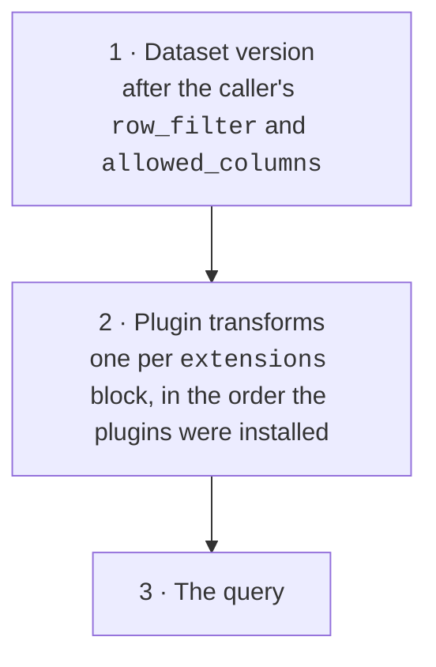
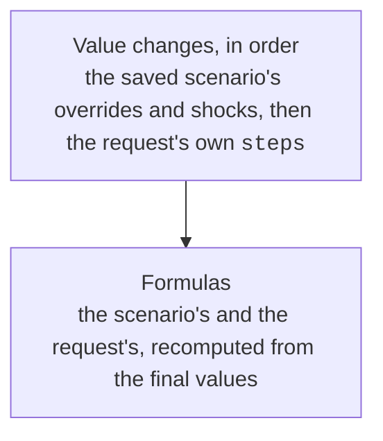

---
covers:
  - packages/calc/src/pylibs_calc/spec/query.py
  - packages/calc/src/pylibs_calc/compile/logical.py
---

# Order of evaluation

The fields of a request can be written in any order. The engine always evaluates them in the same fixed order, so a request means one thing only.

## From dataset to result

## Inside the what-if transform

The [what-if plugin](../whatif/index.md)'s transform has its own fixed order:

## Inside the query

| # | Stage | Works on |
| --- | --- | --- |
| 1 | `filter` | rows |
| 2 | `derive` | rows (new columns, in the order written) |
| 3 | `group_by` + `measures` | rows → groups |
| 4 | `post` | groups (ratios over measures) |
| 5 | `having` | groups |
| 6 | `rollup` | adds subtotal rows |
| 7 | `pivot` | spreads measures across columns |
| 8 | `sort` | the result (always a total order) |
| 9 | `page` | the result |

Without `group_by` or `measures`, stages 3–7 are skipped and the query returns rows, narrowed to `select` if you give one.

## Why the order matters

- **Entitlements come first.** A `row_filter` is applied before anything else, so a total can never include rows the caller may not see.
- **Plugins see the caller's data only.** Transforms run after the entitlements, so a plugin can't reintroduce hidden rows or columns.
- **Formulas see final values.** A price override still changes a `notional` formula, even when the override is appended later or sent as a one-off step on top of a saved scenario. See [Formula columns](../scenarios/formula.md).
- **`filter` comes before aggregation, `having` after it.** To keep only large positions, use `filter`. To keep only large desks, use `having`.
