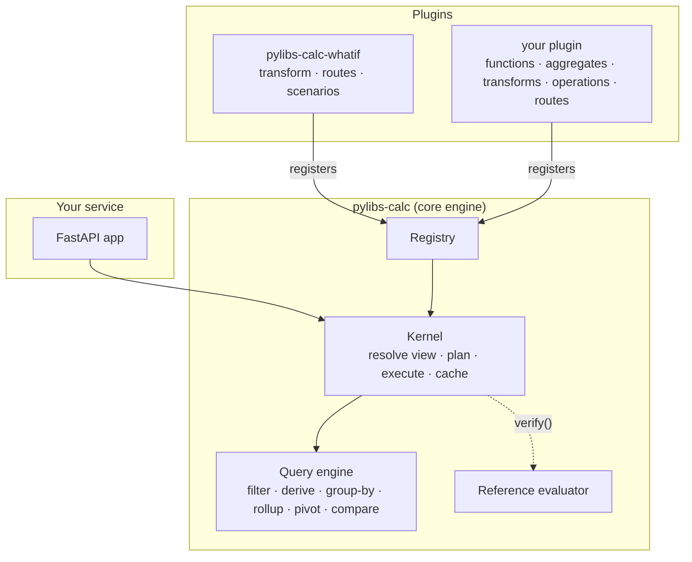
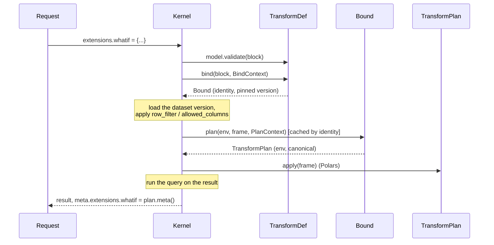

---
covers:
  - packages/calc/src/pylibs_calc/plugins.py
  - packages/calc/src/pylibs_calc/ext.py
  - packages/calc/src/pylibs_calc/engine.py
---

# Plugins

`pylibs-calc` is split in two layers:

- **The core engine** does what nearly every analytics service needs: datasets and versions, filters, derived columns, group-by with filtered and weighted measures, ratios after aggregation, `having`, subtotals, pivots, sorting and paging, compare, exact decimals, caching, entitlements, fingerprints and the reference evaluator.
- **Plugins** build analyses on top of it. What-if analysis (overrides, shocks, formula columns, saved scenarios) is the first one: the [`pylibs-calc-whatif`](../whatif/index.md) package. Sensitivity ladders, goal-seek, period-over-period views or custom risk measures are meant to be plugins too.



## Installing plugins

A plugin is an object you pass to the engine. It registers what it adds when the engine is built:

```python
from pylibs_calc import CalcEngine
from pylibs_calc_whatif import InMemoryScenarioStore, WhatIfPlugin

engine = CalcEngine(catalog, plugins=[WhatIfPlugin(store=InMemoryScenarioStore())])
engine.plugin(WhatIfPlugin).scenarios.create("positions", "tech rally")
```

- Each engine has its own plugins: a function or transform exists only in engines that installed its plugin.
- `discover_plugins()` instantiates every installed plugin package that advertises itself under the `pylibs_calc.plugins` [entry point](https://packaging.python.org/en/latest/specifications/entry-points/) (with no arguments), for services that want whatever is installed: `CalcEngine(catalog, plugins=discover_plugins())`.
- Names are unique. Two plugins registering the same function, aggregate, transform or operation, a name that shadows a built-in, or the same plugin installed twice raise `PluginError` when the engine is built.
- A plugin's `version` is part of every cache key, and appears in `meta.versions` as `plugin:<name>`.

## The extension points

| Extension point | Registered with | Used by a request as | Example |
| --- | --- | --- | --- |
| [Functions](#functions-and-aggregates) | `registry.add_function(FunctionDef)` | a function in any formula | `bps(yield)` |
| [Aggregates](#functions-and-aggregates) | `registry.add_aggregate(AggregateDef)` | a measure's `fn` | `{"fn": "median", "of": "price"}` |
| [Transforms](#transforms) | `registry.add_transform(TransformDef)` | a block under `extensions` | `{"extensions": {"whatif": {...}}}` |
| [Operations](#operations) | `registry.add_operation(OperationDef)` | `engine.call(name, request)` | a sensitivity ladder |
| [HTTP routes](#http-routes) | `registry.add_routes(hook)` | routes on the FastAPI router | `/scenarios/...` |

[Write a plugin](../extending/write-a-plugin.md) builds one of each, step by step.

### Functions and aggregates

A `FunctionDef` or `AggregateDef` gives a name, a type rule and **two implementations**: a Polars expression for the engine and a plain Python function for the [reference evaluator](architecture.md#two-evaluators-one-plan). The engine casts results to the declared type, turns non-finite floats into null and, by default, returns null when an argument is null, identically in both.

Aggregates see the non-null values of each group, and run on the rows of every rollup level and pivot cell, so they don't have to be decomposable: a median or a quantile is correct at every subtotal.

### Transforms

A transform changes the dataset before the query runs: it can change values, add columns, or even drop rows. A request switches it on with a block under `extensions`, named after the transform:

```json
{
  "dataset": "positions",
  "extensions": {"whatif": {"steps": [{"kind": "shock", "column": "price", "op": "pct", "value": 5}]}},
  "query": {"group_by": ["desk"], "measures": [{"name": "mv", "fn": "sum", "of": "price * quantity"}]}
}
```



1. **Parse.** The block is validated with the transform's pydantic `model`. Errors point into it, e.g. `/extensions/whatif/steps/0/column`.
2. **Bind.** `bind(block, BindContext)` resolves references cheaply (the what-if plugin loads the saved scenario's log here) and returns a `Bound`. A `Bound` may pin the dataset version (a saved scenario does).
3. **Plan.** `Bound.plan(env, frame, PlanContext)` validates against the incoming columns and returns a `TransformPlan`. The engine caches it under the bound's `identity`, the dataset version, the caller's context and the transforms before it.
4. **Apply.** `TransformPlan.apply(lazy_frame)` for Polars; `apply_reference(rows)` for `verify()`.

Transforms run **after** the caller's row filter and column restrictions, in the order the plugins were installed, each one seeing the columns and functions of the ones before it. `TransformPlan.canonical` is the transform's identity in every result fingerprint; `meta()` goes to `result.meta.extensions[<name>]` and `explain()` to `engine.explain(...)["extensions"][<name>]`.

[Compare](../scenarios/compare.md) is transform-agnostic: each side has its own `extensions`, so any plugin's transform can be compared against another, or against the plain data.

### Operations

An operation is a new call on the engine, for analyses that are more than one query: a sensitivity ladder, a goal-seek, a multi-period roll-forward. It gets the **`Kernel`**, the engine's machinery with a stable interface:

| `Kernel` method | Does |
| --- | --- |
| `parse(model, request)` | Validates a request (upgrading old versions) |
| `slot()`, `deadline(options)` | An execution slot, and the request's deadline |
| `resolve_view(dataset, extensions, ctx, deadline=...)` | A `View`: the dataset with transforms applied |
| `plan_query(query, view)` | The logical plan of a query on a view |
| `query(view, query, options, ctx, deadline=...)` | Runs a query on a view, with the cache: a `CalcResult` |
| `aggregate(...)`, `leaf(...)`, `evaluate_aggregate(...)`, `collect(...)` | Lower-level execution |
| `identity(...)`, `cache_key(...)`, `meta(...)` | Fingerprints, cache keys and result metadata |
| `finish(result, ctx)` | Hands the result to `EngineConfig.on_result` |
| `authorize(ctx, action, resource)` | Calls your `EngineConfig.authorize` hook |

`engine.call("name", request)` runs an operation from Python, and the FastAPI router exposes every operation as `POST /operations/{name}` (`GET /operations` lists them).

### HTTP routes

`registry.add_routes(hook)` adds routes when you build the router with `create_router(engine)`. The hook gets the FastAPI `APIRouter` and a `RouterKit` with the engine, the caller-context dependency and helpers that turn `CalcError`s into HTTP errors and results into JSON or Arrow. Route modules must not use `from __future__ import annotations`, because FastAPI needs real annotation objects.

## What a plugin may import

Plugins use only the public API:

- `pylibs_calc`: everything in `pylibs_calc.__all__`, including the plugin API above;
- `pylibs_calc.ext`: the building blocks for expressions and types (`check`, `compile_expr`, `evaluate`, `LType`, `Model`, …);
- `pylibs_calc.integrations.fastapi` (for routes) and `pylibs_calc.testing` (in tests).

Anything else under `pylibs_calc` is private and may change in any release. The what-if plugin's test suite checks that it follows this rule, and that the core never imports the plugin.
