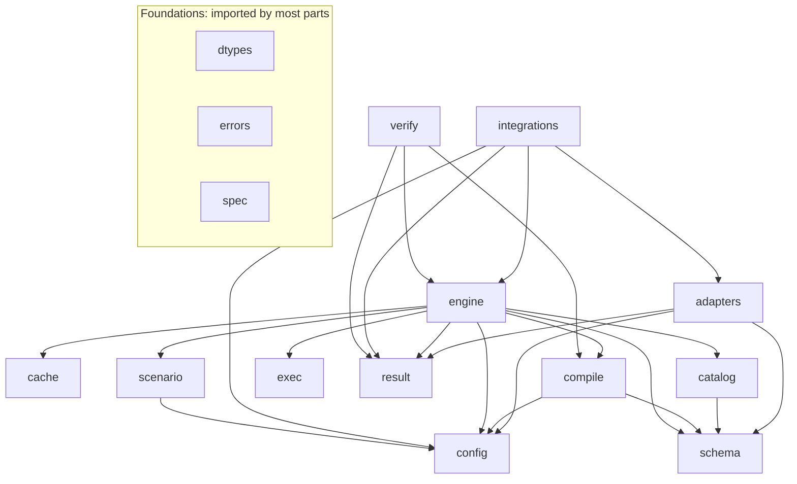

<!-- Generated by scripts/docs_from_graph.py from graphify-out/graph.json. Do not edit by hand: run `make docs-sync`. -->

# Components

A map of `pylibs-calc` generated from the code knowledge graph (graphify), built at commit `580901aa8505`. It lists every module with its public classes and functions, what each part imports and which components the rest of the code relies on most. For how the parts work together, read [Architecture](../../concepts/architecture.md).

## How the parts depend on each other

An arrow `A --> B` means code in `A` imports from `B`. Foundations, the parts that most others import, are shown on their own without arrows to keep the picture readable.

## Most used components

Ranked by how many other source files (tests included) call, reference or subclass them.

| Component | Kind | Module | Used from files |
| --- | --- | --- | --- |
| [`CalcEngine`](https://github.com/sanjaysharmagwl/py-libs/blob/master/packages/calc/src/pylibs_calc/engine.py#L147) | class | `pylibs_calc.engine` | 15 |
| [`SpecError`](https://github.com/sanjaysharmagwl/py-libs/blob/master/packages/calc/src/pylibs_calc/errors.py#L44) | class | `pylibs_calc.errors` | 15 |
| [`CalcContext`](https://github.com/sanjaysharmagwl/py-libs/blob/master/packages/calc/src/pylibs_calc/config.py#L31) | class | `pylibs_calc.config` | 13 |
| [`LType`](https://github.com/sanjaysharmagwl/py-libs/blob/master/packages/calc/src/pylibs_calc/dtypes.py#L68) | class | `pylibs_calc.dtypes` | 11 |
| [`Catalog`](https://github.com/sanjaysharmagwl/py-libs/blob/master/packages/calc/src/pylibs_calc/catalog.py#L69) | class | `pylibs_calc.catalog` | 10 |
| [`Kind`](https://github.com/sanjaysharmagwl/py-libs/blob/master/packages/calc/src/pylibs_calc/dtypes.py#L37) | class | `pylibs_calc.dtypes` | 10 |
| [`InMemoryScenarioStore`](https://github.com/sanjaysharmagwl/py-libs/blob/master/packages/calc/src/pylibs_calc/scenario/store.py#L60) | class | `pylibs_calc.scenario.store` | 9 |
| [`Limits`](https://github.com/sanjaysharmagwl/py-libs/blob/master/packages/calc/src/pylibs_calc/config.py#L14) | class | `pylibs_calc.config` | 9 |
| [`Binary`](https://github.com/sanjaysharmagwl/py-libs/blob/master/packages/calc/src/pylibs_calc/spec/expr.py#L125) | class | `pylibs_calc.spec.expr` | 8 |
| [`ColRef`](https://github.com/sanjaysharmagwl/py-libs/blob/master/packages/calc/src/pylibs_calc/spec/expr.py#L62) | class | `pylibs_calc.spec.expr` | 8 |
| [`Compare`](https://github.com/sanjaysharmagwl/py-libs/blob/master/packages/calc/src/pylibs_calc/spec/expr.py#L138) | class | `pylibs_calc.spec.expr` | 7 |
| [`IsNull`](https://github.com/sanjaysharmagwl/py-libs/blob/master/packages/calc/src/pylibs_calc/spec/expr.py#L166) | class | `pylibs_calc.spec.expr` | 7 |

## Third-party dependencies by part

| Part | Imports |
| --- | --- |
| `__init__` | — |
| `adapters` | `pydantic` |
| `cache` | `polars` |
| `catalog` | `polars` |
| `compile` | `polars` |
| `config` | — |
| `dtypes` | `polars` |
| `engine` | `polars`, `pydantic` |
| `errors` | — |
| `exec` | `polars` |
| `integrations` | `fastapi` |
| `result` | `polars`, `pydantic` |
| `scenario` | `pydantic`, `redis` |
| `schema` | `polars`, `pydantic` |
| `spec` | `pydantic`, `pydantic_core` |
| `verify` | — |

All third-party imports: `fastapi`, `polars`, `pydantic`, `pydantic_core`, `redis`.

## Modules

### `pylibs_calc`

Embeddable what-if calculation engine on Polars. Filters, overrides, shocks,…

Source: [`packages/calc/src/pylibs_calc/__init__.py`](https://github.com/sanjaysharmagwl/py-libs/blob/master/packages/calc/src/pylibs_calc/__init__.py)

### `pylibs_calc.adapters`

Adapters from UI protocols to engine requests.

Source: [`packages/calc/src/pylibs_calc/adapters/__init__.py`](https://github.com/sanjaysharmagwl/py-libs/blob/master/packages/calc/src/pylibs_calc/adapters/__init__.py)

### `pylibs_calc.adapters.aggrid`

AG Grid Server-Side Row Model (SSRM) adapter. Pure translation; no web…

Source: [`packages/calc/src/pylibs_calc/adapters/aggrid.py`](https://github.com/sanjaysharmagwl/py-libs/blob/master/packages/calc/src/pylibs_calc/adapters/aggrid.py)

| Name | Kind | Summary |
| --- | --- | --- |
| [`ColumnVO`](https://github.com/sanjaysharmagwl/py-libs/blob/master/packages/calc/src/pylibs_calc/adapters/aggrid.py#L64) | class | Methods: `column`. |
| [`SortModelItem`](https://github.com/sanjaysharmagwl/py-libs/blob/master/packages/calc/src/pylibs_calc/adapters/aggrid.py#L75) | class | — |
| [`ServerSideRequest`](https://github.com/sanjaysharmagwl/py-libs/blob/master/packages/calc/src/pylibs_calc/adapters/aggrid.py#L80) | class | `IServerSideGetRowsRequest` as AG Grid sends it. |
| [`RowsResponse`](https://github.com/sanjaysharmagwl/py-libs/blob/master/packages/calc/src/pylibs_calc/adapters/aggrid.py#L94) | class | What the datasource passes to `params.success(...)`. |
| [`CellEdit`](https://github.com/sanjaysharmagwl/py-libs/blob/master/packages/calc/src/pylibs_calc/adapters/aggrid.py#L102) | class | The useful part of AG Grid's `CellEditRequestEvent`. |
| [`Shape`](https://github.com/sanjaysharmagwl/py-libs/blob/master/packages/calc/src/pylibs_calc/adapters/aggrid.py#L112) | class | How to decorate result rows for the grid. |
| [`AgGridAdapter`](https://github.com/sanjaysharmagwl/py-libs/blob/master/packages/calc/src/pylibs_calc/adapters/aggrid.py#L127) | class | Translate SSRM requests into engine requests and results back into grid rows.… Methods: `edit_to_override`, `filter_expr`, `measure`, `pivot_domain_request`, `rows`, `to_request`, `to_response`. |
| [`encode_group_key`](https://github.com/sanjaysharmagwl/py-libs/blob/master/packages/calc/src/pylibs_calc/adapters/aggrid.py#L539) | function | — |
| [`decode_group_key`](https://github.com/sanjaysharmagwl/py-libs/blob/master/packages/calc/src/pylibs_calc/adapters/aggrid.py#L543) | function | — |

Imports: `pylibs_calc.config`, `pylibs_calc.dtypes`, `pylibs_calc.errors`, `pylibs_calc.result`, `pylibs_calc.schema`, `pylibs_calc.spec.expr`, `pylibs_calc.spec.query`, `pylibs_calc.spec.scenario`

### `pylibs_calc.cache`

A byte-bounded LRU cache of result frames. Keys are content hashes of…

Source: [`packages/calc/src/pylibs_calc/cache.py`](https://github.com/sanjaysharmagwl/py-libs/blob/master/packages/calc/src/pylibs_calc/cache.py)

| Name | Kind | Summary |
| --- | --- | --- |
| [`ResultCache`](https://github.com/sanjaysharmagwl/py-libs/blob/master/packages/calc/src/pylibs_calc/cache.py#L19) | class | Methods: `clear`, `get`, `put`, `size_bytes`. |
| [`frame_size`](https://github.com/sanjaysharmagwl/py-libs/blob/master/packages/calc/src/pylibs_calc/cache.py#L64) | function | — |

### `pylibs_calc.catalog`

Datasets the engine can query, pinned to immutable versions. A catalog…

Source: [`packages/calc/src/pylibs_calc/catalog.py`](https://github.com/sanjaysharmagwl/py-libs/blob/master/packages/calc/src/pylibs_calc/catalog.py)

| Name | Kind | Summary |
| --- | --- | --- |
| [`Dataset`](https://github.com/sanjaysharmagwl/py-libs/blob/master/packages/calc/src/pylibs_calc/catalog.py#L31) | class | One immutable version of a dataset. Methods: `has_row_index`, `key_columns`, `lazy`, `rows`. |
| [`DatasetCatalog`](https://github.com/sanjaysharmagwl/py-libs/blob/master/packages/calc/src/pylibs_calc/catalog.py#L61) | class | What the engine needs from a catalog; implement it to serve datasets your own… Methods: `get`, `list`. |
| [`Catalog`](https://github.com/sanjaysharmagwl/py-libs/blob/master/packages/calc/src/pylibs_calc/catalog.py#L69) | class | Thread-safe in-process catalog of in-memory frames and lazily scanned files.… Methods: `drop`, `get`, `list`, `register_frame`, `register_scan`. |
| [`raw`](https://github.com/sanjaysharmagwl/py-libs/blob/master/packages/calc/src/pylibs_calc/catalog.py#L136) | function | — |
| [`scan`](https://github.com/sanjaysharmagwl/py-libs/blob/master/packages/calc/src/pylibs_calc/catalog.py#L144) | function | — |
| [`normalize`](https://github.com/sanjaysharmagwl/py-libs/blob/master/packages/calc/src/pylibs_calc/catalog.py#L198) | function | — |
| [`content_version`](https://github.com/sanjaysharmagwl/py-libs/blob/master/packages/calc/src/pylibs_calc/catalog.py#L223) | function | A version id derived from the data (row order included). Stable within a Polars… |
| [`file_version`](https://github.com/sanjaysharmagwl/py-libs/blob/master/packages/calc/src/pylibs_calc/catalog.py#L233) | function | — |

Imports: `pylibs_calc.dtypes`, `pylibs_calc.errors`, `pylibs_calc.schema`

### `pylibs_calc.compile`

From spec to execution: validation, logical plans and Polars plans.

Source: [`packages/calc/src/pylibs_calc/compile/__init__.py`](https://github.com/sanjaysharmagwl/py-libs/blob/master/packages/calc/src/pylibs_calc/compile/__init__.py)

### `pylibs_calc.compile.compare`

Two-way compare: join a target and a base result, with deltas typed like any…

Source: [`packages/calc/src/pylibs_calc/compile/compare.py`](https://github.com/sanjaysharmagwl/py-libs/blob/master/packages/calc/src/pylibs_calc/compile/compare.py)

| Name | Kind | Summary |
| --- | --- | --- |
| [`ComparePlan`](https://github.com/sanjaysharmagwl/py-libs/blob/master/packages/calc/src/pylibs_calc/compile/compare.py#L26) | class | — |
| [`plan_compare`](https://github.com/sanjaysharmagwl/py-libs/blob/master/packages/calc/src/pylibs_calc/compile/compare.py#L33) | function | — |
| [`compare_frame`](https://github.com/sanjaysharmagwl/py-libs/blob/master/packages/calc/src/pylibs_calc/compile/compare.py#L77) | function | — |

Imports: `pylibs_calc.compile.exprs`, `pylibs_calc.compile.validate`, `pylibs_calc.dtypes`, `pylibs_calc.errors`, `pylibs_calc.spec.expr`

### `pylibs_calc.compile.exprs`

Typed expression tree -> Polars expression. Casts follow the typing rules in…

Source: [`packages/calc/src/pylibs_calc/compile/exprs.py`](https://github.com/sanjaysharmagwl/py-libs/blob/master/packages/calc/src/pylibs_calc/compile/exprs.py)

| Name | Kind | Summary |
| --- | --- | --- |
| [`dec_dtype`](https://github.com/sanjaysharmagwl/py-libs/blob/master/packages/calc/src/pylibs_calc/compile/exprs.py#L50) | function | — |
| [`as_type`](https://github.com/sanjaysharmagwl/py-libs/blob/master/packages/calc/src/pylibs_calc/compile/exprs.py#L54) | function | Cast `expr` (of logical type `source`) to `target`. Narrowing a decimal… |
| [`finite`](https://github.com/sanjaysharmagwl/py-libs/blob/master/packages/calc/src/pylibs_calc/compile/exprs.py#L75) | function | Null out NaN and infinities. |
| [`nonzero`](https://github.com/sanjaysharmagwl/py-libs/blob/master/packages/calc/src/pylibs_calc/compile/exprs.py#L80) | function | — |
| [`lit_value`](https://github.com/sanjaysharmagwl/py-libs/blob/master/packages/calc/src/pylibs_calc/compile/exprs.py#L84) | function | The Python value of a literal (decimals exact, dates parsed). |
| [`compile_expr`](https://github.com/sanjaysharmagwl/py-libs/blob/master/packages/calc/src/pylibs_calc/compile/exprs.py#L96) | function | — |
| [`materialize`](https://github.com/sanjaysharmagwl/py-libs/blob/master/packages/calc/src/pylibs_calc/compile/exprs.py#L148) | function | Compile and cast to the canonical dtype of the (rigid) result type. |

Imports: `pylibs_calc.compile.validate`, `pylibs_calc.dtypes`, `pylibs_calc.errors`, `pylibs_calc.spec.expr`

### `pylibs_calc.compile.logical`

Logical plans: a validated, typed description of what a request computes. All…

Source: [`packages/calc/src/pylibs_calc/compile/logical.py`](https://github.com/sanjaysharmagwl/py-libs/blob/master/packages/calc/src/pylibs_calc/compile/logical.py)

| Name | Kind | Summary |
| --- | --- | --- |
| [`LabeledStep`](https://github.com/sanjaysharmagwl/py-libs/blob/master/packages/calc/src/pylibs_calc/compile/logical.py#L45) | class | A scenario step plus where it came from (for error paths and lineage). |
| [`OverrideBatch`](https://github.com/sanjaysharmagwl/py-libs/blob/master/packages/calc/src/pylibs_calc/compile/logical.py#L53) | class | Consecutive overrides, compacted: column -> {key tuple: new value}. Last write… |
| [`ShockOp`](https://github.com/sanjaysharmagwl/py-libs/blob/master/packages/calc/src/pylibs_calc/compile/logical.py#L61) | class | — |
| [`FormulaDef`](https://github.com/sanjaysharmagwl/py-libs/blob/master/packages/calc/src/pylibs_calc/compile/logical.py#L72) | class | — |
| [`LogicalMutations`](https://github.com/sanjaysharmagwl/py-libs/blob/master/packages/calc/src/pylibs_calc/compile/logical.py#L80) | class | Methods: `empty`. |
| [`effective_steps`](https://github.com/sanjaysharmagwl/py-libs/blob/master/packages/calc/src/pylibs_calc/compile/logical.py#L95) | function | Drop `Disable` steps and the steps they disable. Sequence numbers start at… |
| [`plan_mutations`](https://github.com/sanjaysharmagwl/py-libs/blob/master/packages/calc/src/pylibs_calc/compile/logical.py#L124) | function | — |
| [`flush`](https://github.com/sanjaysharmagwl/py-libs/blob/master/packages/calc/src/pylibs_calc/compile/logical.py#L144) | function | — |
| [`DerivePlan`](https://github.com/sanjaysharmagwl/py-libs/blob/master/packages/calc/src/pylibs_calc/compile/logical.py#L328) | class | — |
| [`HiddenAgg`](https://github.com/sanjaysharmagwl/py-libs/blob/master/packages/calc/src/pylibs_calc/compile/logical.py#L337) | class | One aggregate over rows. `sum` of no values is null (SQL semantics). |
| [`MeasurePlan`](https://github.com/sanjaysharmagwl/py-libs/blob/master/packages/calc/src/pylibs_calc/compile/logical.py#L348) | class | — |
| [`PostPlan`](https://github.com/sanjaysharmagwl/py-libs/blob/master/packages/calc/src/pylibs_calc/compile/logical.py#L356) | class | — |
| [`PivotPlan`](https://github.com/sanjaysharmagwl/py-libs/blob/master/packages/calc/src/pylibs_calc/compile/logical.py#L363) | class | — |
| [`SortSpec`](https://github.com/sanjaysharmagwl/py-libs/blob/master/packages/calc/src/pylibs_calc/compile/logical.py#L374) | class | — |
| [`LogicalQuery`](https://github.com/sanjaysharmagwl/py-libs/blob/master/packages/calc/src/pylibs_calc/compile/logical.py#L381) | class | Methods: `value_names`. |
| [`plan_query`](https://github.com/sanjaysharmagwl/py-libs/blob/master/packages/calc/src/pylibs_calc/compile/logical.py#L404) | function | — |
| [`budget`](https://github.com/sanjaysharmagwl/py-libs/blob/master/packages/calc/src/pylibs_calc/compile/logical.py#L413) | function | — |
| [`hidden`](https://github.com/sanjaysharmagwl/py-libs/blob/master/packages/calc/src/pylibs_calc/compile/logical.py#L576) | function | — |

Imports: `pylibs_calc.compile.validate`, `pylibs_calc.config`, `pylibs_calc.dtypes`, `pylibs_calc.errors`, `pylibs_calc.schema`, `pylibs_calc.spec.canonical`, `pylibs_calc.spec.expr`, `pylibs_calc.spec.query`, `pylibs_calc.spec.scenario`

### `pylibs_calc.compile.mutations`

Apply a :class:`LogicalMutations` plan to a Polars LazyFrame. Only edited…

Source: [`packages/calc/src/pylibs_calc/compile/mutations.py`](https://github.com/sanjaysharmagwl/py-libs/blob/master/packages/calc/src/pylibs_calc/compile/mutations.py)

| Name | Kind | Summary |
| --- | --- | --- |
| [`apply_mutations`](https://github.com/sanjaysharmagwl/py-libs/blob/master/packages/calc/src/pylibs_calc/compile/mutations.py#L21) | function | — |
| [`edit_keys_frame`](https://github.com/sanjaysharmagwl/py-libs/blob/master/packages/calc/src/pylibs_calc/compile/mutations.py#L33) | function | The distinct keys the overrides touch, typed like the dataset's key columns. |
| [`dtype_of`](https://github.com/sanjaysharmagwl/py-libs/blob/master/packages/calc/src/pylibs_calc/compile/mutations.py#L49) | function | — |
| [`shocked_value`](https://github.com/sanjaysharmagwl/py-libs/blob/master/packages/calc/src/pylibs_calc/compile/mutations.py#L108) | function | — |

Imports: `pylibs_calc.compile.exprs`, `pylibs_calc.compile.logical`, `pylibs_calc.dtypes`

### `pylibs_calc.compile.query`

Build Polars plans for a :class:`LogicalQuery`, and finish them eagerly. Row…

Source: [`packages/calc/src/pylibs_calc/compile/query.py`](https://github.com/sanjaysharmagwl/py-libs/blob/master/packages/calc/src/pylibs_calc/compile/query.py)

| Name | Kind | Summary |
| --- | --- | --- |
| [`rows_frame`](https://github.com/sanjaysharmagwl/py-libs/blob/master/packages/calc/src/pylibs_calc/compile/query.py#L29) | function | The filtered rows with derived columns: the input of every aggregate. |
| [`leaf_frame`](https://github.com/sanjaysharmagwl/py-libs/blob/master/packages/calc/src/pylibs_calc/compile/query.py#L44) | function | — |
| [`count_frame`](https://github.com/sanjaysharmagwl/py-libs/blob/master/packages/calc/src/pylibs_calc/compile/query.py#L69) | function | — |
| [`agg_frame`](https://github.com/sanjaysharmagwl/py-libs/blob/master/packages/calc/src/pylibs_calc/compile/query.py#L73) | function | Aggregate at the group level (and every rollup level), including pivot columns. |
| [`totals_frame`](https://github.com/sanjaysharmagwl/py-libs/blob/master/packages/calc/src/pylibs_calc/compile/query.py#L80) | function | Pivot totals: the same measures without splitting by the pivot columns. |
| [`domain_frame`](https://github.com/sanjaysharmagwl/py-libs/blob/master/packages/calc/src/pylibs_calc/compile/query.py#L85) | function | — |
| [`Finished`](https://github.com/sanjaysharmagwl/py-libs/blob/master/packages/calc/src/pylibs_calc/compile/query.py#L173) | class | — |
| [`finish_aggregate`](https://github.com/sanjaysharmagwl/py-libs/blob/master/packages/calc/src/pylibs_calc/compile/query.py#L180) | function | — |
| [`sort_frame`](https://github.com/sanjaysharmagwl/py-libs/blob/master/packages/calc/src/pylibs_calc/compile/query.py#L211) | function | — |
| [`pivot_label`](https://github.com/sanjaysharmagwl/py-libs/blob/master/packages/calc/src/pylibs_calc/compile/query.py#L247) | function | — |

Imports: `pylibs_calc.compile.exprs`, `pylibs_calc.compile.logical`, `pylibs_calc.config`, `pylibs_calc.dtypes`, `pylibs_calc.errors`

### `pylibs_calc.compile.validate`

Type checking: turns an expression tree into a :class:`Typed` tree against a…

Source: [`packages/calc/src/pylibs_calc/compile/validate.py`](https://github.com/sanjaysharmagwl/py-libs/blob/master/packages/calc/src/pylibs_calc/compile/validate.py)

| Name | Kind | Summary |
| --- | --- | --- |
| [`Typed`](https://github.com/sanjaysharmagwl/py-libs/blob/master/packages/calc/src/pylibs_calc/compile/validate.py#L55) | class | An expression node with its result type and the type its operands are cast to. |
| [`Budget`](https://github.com/sanjaysharmagwl/py-libs/blob/master/packages/calc/src/pylibs_calc/compile/validate.py#L65) | class | — |
| [`lit_type`](https://github.com/sanjaysharmagwl/py-libs/blob/master/packages/calc/src/pylibs_calc/compile/validate.py#L71) | function | — |
| [`check`](https://github.com/sanjaysharmagwl/py-libs/blob/master/packages/calc/src/pylibs_calc/compile/validate.py#L79) | function | — |
| [`check_predicate`](https://github.com/sanjaysharmagwl/py-libs/blob/master/packages/calc/src/pylibs_calc/compile/validate.py#L91) | function | — |

Imports: `pylibs_calc.dtypes`, `pylibs_calc.errors`, `pylibs_calc.spec.expr`

### `pylibs_calc.config`

Limits and per-request context.

Source: [`packages/calc/src/pylibs_calc/config.py`](https://github.com/sanjaysharmagwl/py-libs/blob/master/packages/calc/src/pylibs_calc/config.py)

| Name | Kind | Summary |
| --- | --- | --- |
| [`Limits`](https://github.com/sanjaysharmagwl/py-libs/blob/master/packages/calc/src/pylibs_calc/config.py#L14) | class | Hard caps that keep a single request from exhausting a pod. Exceeding one is a… |
| [`CalcContext`](https://github.com/sanjaysharmagwl/py-libs/blob/master/packages/calc/src/pylibs_calc/config.py#L31) | class | Who is asking, and what they may see. Supplied by the host service per request.… Methods: `digest`, `row_filter_node`. |

Imports: `pylibs_calc.spec.canonical`, `pylibs_calc.spec.expr`

### `pylibs_calc.dtypes`

Logical types and the typing rules shared by the validator, the compiler and…

Source: [`packages/calc/src/pylibs_calc/dtypes.py`](https://github.com/sanjaysharmagwl/py-libs/blob/master/packages/calc/src/pylibs_calc/dtypes.py)

| Name | Kind | Summary |
| --- | --- | --- |
| [`Kind`](https://github.com/sanjaysharmagwl/py-libs/blob/master/packages/calc/src/pylibs_calc/dtypes.py#L37) | class | — |
| [`NumericConfig`](https://github.com/sanjaysharmagwl/py-libs/blob/master/packages/calc/src/pylibs_calc/dtypes.py#L56) | class | Engine-wide numeric settings; they are part of every result fingerprint. |
| [`LType`](https://github.com/sanjaysharmagwl/py-libs/blob/master/packages/calc/src/pylibs_calc/dtypes.py#L68) | class | A logical type. `scale` is set for decimals only; `flex` marks literal-… Methods: `numeric`. |
| [`rigid`](https://github.com/sanjaysharmagwl/py-libs/blob/master/packages/calc/src/pylibs_calc/dtypes.py#L79) | function | — |
| [`decimal`](https://github.com/sanjaysharmagwl/py-libs/blob/master/packages/calc/src/pylibs_calc/dtypes.py#L97) | function | — |
| [`from_polars`](https://github.com/sanjaysharmagwl/py-libs/blob/master/packages/calc/src/pylibs_calc/dtypes.py#L106) | function | Map a Polars dtype to a logical type (`OTHER` if the engine can't compute… |
| [`to_polars`](https://github.com/sanjaysharmagwl/py-libs/blob/master/packages/calc/src/pylibs_calc/dtypes.py#L127) | function | The canonical Polars dtype the engine uses for a logical type. |
| [`normalized_dtype`](https://github.com/sanjaysharmagwl/py-libs/blob/master/packages/calc/src/pylibs_calc/dtypes.py#L149) | function | The dtype a catalog stores a column as, or `None` to keep it unchanged.… |
| [`common_type`](https://github.com/sanjaysharmagwl/py-libs/blob/master/packages/calc/src/pylibs_calc/dtypes.py#L175) | function | The type two values are compared, coalesced or chosen between as (no scale… |
| [`arith_result`](https://github.com/sanjaysharmagwl/py-libs/blob/master/packages/calc/src/pylibs_calc/dtypes.py#L209) | function | Result type of `a <op> b`. Operands are cast to `common_type` first (see… |
| [`canonical_decimal`](https://github.com/sanjaysharmagwl/py-libs/blob/master/packages/calc/src/pylibs_calc/dtypes.py#L247) | function | Shortest plain (non-exponent) text for a decimal; `-0` becomes `0`. |
| [`decimal_places`](https://github.com/sanjaysharmagwl/py-libs/blob/master/packages/calc/src/pylibs_calc/dtypes.py#L257) | function | — |
| [`quantize`](https://github.com/sanjaysharmagwl/py-libs/blob/master/packages/calc/src/pylibs_calc/dtypes.py#L263) | function | — |
| [`parse_decimal`](https://github.com/sanjaysharmagwl/py-libs/blob/master/packages/calc/src/pylibs_calc/dtypes.py#L269) | function | Parse a JSON number or numeric string into an exact decimal. |
| [`coerce_value`](https://github.com/sanjaysharmagwl/py-libs/blob/master/packages/calc/src/pylibs_calc/dtypes.py#L290) | function | Convert a JSON scalar into the Python value a column of `ltype` holds.… |
| [`json_value`](https://github.com/sanjaysharmagwl/py-libs/blob/master/packages/calc/src/pylibs_calc/dtypes.py#L353) | function | Canonical JSON form of a column value (decimals and dates as strings). |

Imports: `pylibs_calc.errors`

### `pylibs_calc.engine`

The calculation engine: resolve the dataset and scenario, plan, execute, cache,…

Source: [`packages/calc/src/pylibs_calc/engine.py`](https://github.com/sanjaysharmagwl/py-libs/blob/master/packages/calc/src/pylibs_calc/engine.py)

| Name | Kind | Summary |
| --- | --- | --- |
| [`EngineConfig`](https://github.com/sanjaysharmagwl/py-libs/blob/master/packages/calc/src/pylibs_calc/engine.py#L90) | class | Engine-wide settings. `authorize(ctx, action, scenario)` is called for… |
| [`Side`](https://github.com/sanjaysharmagwl/py-libs/blob/master/packages/calc/src/pylibs_calc/engine.py#L110) | class | A dataset version with a scenario applied, as one caller sees it. Methods: `identity`. |
| [`validation_error`](https://github.com/sanjaysharmagwl/py-libs/blob/master/packages/calc/src/pylibs_calc/engine.py#L131) | function | Turn a pydantic error into a :class:`SpecError` with a JSON-pointer path. |
| [`CalcEngine`](https://github.com/sanjaysharmagwl/py-libs/blob/master/packages/calc/src/pylibs_calc/engine.py#L147) | class | Methods: `authorize`, `compare`, `distinct_values`, `evaluate_aggregate`, `explain`, `parse`, `run`, `scenarios`, `schema`, `validate_steps`. |

Imports: `pylibs_calc.cache`, `pylibs_calc.catalog`, `pylibs_calc.compile.compare`, `pylibs_calc.compile.exprs`, `pylibs_calc.compile.logical`, `pylibs_calc.compile.mutations`, `pylibs_calc.compile.query`, `pylibs_calc.compile.validate`, `pylibs_calc.config`, `pylibs_calc.dtypes`, `pylibs_calc.errors`, `pylibs_calc.exec`, `pylibs_calc.result`, `pylibs_calc.scenario.manager`, `pylibs_calc.scenario.model`, `pylibs_calc.scenario.store`, `pylibs_calc.schema`, `pylibs_calc.spec.canonical`, `pylibs_calc.spec.query`, `pylibs_calc.spec.scenario`

### `pylibs_calc.errors`

Error types with a stable `code`, a JSON-pointer `path` and an HTTP status.

Source: [`packages/calc/src/pylibs_calc/errors.py`](https://github.com/sanjaysharmagwl/py-libs/blob/master/packages/calc/src/pylibs_calc/errors.py)

| Name | Kind | Summary |
| --- | --- | --- |
| [`CalcError`](https://github.com/sanjaysharmagwl/py-libs/blob/master/packages/calc/src/pylibs_calc/errors.py#L8) | class | Base class for every error the engine raises on purpose. `code` is stable and… Methods: `to_dict`. |
| [`SpecError`](https://github.com/sanjaysharmagwl/py-libs/blob/master/packages/calc/src/pylibs_calc/errors.py#L44) | class | The request is well-formed JSON but not a valid calculation (unknown column,… |
| [`ComputeError`](https://github.com/sanjaysharmagwl/py-libs/blob/master/packages/calc/src/pylibs_calc/errors.py#L51) | class | Polars failed while evaluating a valid request (overflow, bad cast in the data). |
| [`NotFound`](https://github.com/sanjaysharmagwl/py-libs/blob/master/packages/calc/src/pylibs_calc/errors.py#L58) | class | — |
| [`DatasetNotFound`](https://github.com/sanjaysharmagwl/py-libs/blob/master/packages/calc/src/pylibs_calc/errors.py#L63) | class | — |
| [`ScenarioNotFound`](https://github.com/sanjaysharmagwl/py-libs/blob/master/packages/calc/src/pylibs_calc/errors.py#L67) | class | — |
| [`Forbidden`](https://github.com/sanjaysharmagwl/py-libs/blob/master/packages/calc/src/pylibs_calc/errors.py#L71) | class | — |
| [`VersionConflict`](https://github.com/sanjaysharmagwl/py-libs/blob/master/packages/calc/src/pylibs_calc/errors.py#L76) | class | A scenario append used a stale `expected_version` or pinned mismatching… |
| [`LimitExceeded`](https://github.com/sanjaysharmagwl/py-libs/blob/master/packages/calc/src/pylibs_calc/errors.py#L83) | class | — |
| [`EngineBusy`](https://github.com/sanjaysharmagwl/py-libs/blob/master/packages/calc/src/pylibs_calc/errors.py#L88) | class | No execution slot became free before the queue timeout. |
| [`CalcTimeout`](https://github.com/sanjaysharmagwl/py-libs/blob/master/packages/calc/src/pylibs_calc/errors.py#L95) | class | — |
| [`join_path`](https://github.com/sanjaysharmagwl/py-libs/blob/master/packages/calc/src/pylibs_calc/errors.py#L100) | function | Append JSON-pointer segments to `base`. |

### `pylibs_calc.exec`

Running Polars plans: concurrency slots, timeouts with cancellation, runtime…

Source: [`packages/calc/src/pylibs_calc/exec.py`](https://github.com/sanjaysharmagwl/py-libs/blob/master/packages/calc/src/pylibs_calc/exec.py)

| Name | Kind | Summary |
| --- | --- | --- |
| [`Executor`](https://github.com/sanjaysharmagwl/py-libs/blob/master/packages/calc/src/pylibs_calc/exec.py#L29) | class | Methods: `collect`, `slot`. |
| [`drain`](https://github.com/sanjaysharmagwl/py-libs/blob/master/packages/calc/src/pylibs_calc/exec.py#L83) | function | — |
| [`RuntimeReport`](https://github.com/sanjaysharmagwl/py-libs/blob/master/packages/calc/src/pylibs_calc/exec.py#L96) | class | — |
| [`runtime_check`](https://github.com/sanjaysharmagwl/py-libs/blob/master/packages/calc/src/pylibs_calc/exec.py#L103) | function | Compare the Polars thread pool with the container's CPU limit (cgroup v1 or… |
| [`cgroup_cpu_limit`](https://github.com/sanjaysharmagwl/py-libs/blob/master/packages/calc/src/pylibs_calc/exec.py#L123) | function | CPU limit from cgroup v2 `cpu.max` or v1 `cpu.cfs_quota_us`; None if… |

Imports: `pylibs_calc.errors`

### `pylibs_calc.integrations`

Optional integrations with web frameworks (each needs its extra installed).

Source: [`packages/calc/src/pylibs_calc/integrations/__init__.py`](https://github.com/sanjaysharmagwl/py-libs/blob/master/packages/calc/src/pylibs_calc/integrations/__init__.py)

### `pylibs_calc.integrations.fastapi`

FastAPI router exposing a :class:`CalcEngine` (`pip install 'pylibs-…

Source: [`packages/calc/src/pylibs_calc/integrations/fastapi.py`](https://github.com/sanjaysharmagwl/py-libs/blob/master/packages/calc/src/pylibs_calc/integrations/fastapi.py)

| Name | Kind | Summary |
| --- | --- | --- |
| [`create_router`](https://github.com/sanjaysharmagwl/py-libs/blob/master/packages/calc/src/pylibs_calc/integrations/fastapi.py#L59) | function | — |
| [`body_limit`](https://github.com/sanjaysharmagwl/py-libs/blob/master/packages/calc/src/pylibs_calc/integrations/fastapi.py#L75) | function | — |
| [`context`](https://github.com/sanjaysharmagwl/py-libs/blob/master/packages/calc/src/pylibs_calc/integrations/fastapi.py#L81) | function | — |
| [`list_datasets`](https://github.com/sanjaysharmagwl/py-libs/blob/master/packages/calc/src/pylibs_calc/integrations/fastapi.py#L94) | function | — |
| [`dataset_schema`](https://github.com/sanjaysharmagwl/py-libs/blob/master/packages/calc/src/pylibs_calc/integrations/fastapi.py#L100) | function | — |
| [`run_query`](https://github.com/sanjaysharmagwl/py-libs/blob/master/packages/calc/src/pylibs_calc/integrations/fastapi.py#L106) | function | — |
| [`run_compare`](https://github.com/sanjaysharmagwl/py-libs/blob/master/packages/calc/src/pylibs_calc/integrations/fastapi.py#L111) | function | — |
| [`run_explain`](https://github.com/sanjaysharmagwl/py-libs/blob/master/packages/calc/src/pylibs_calc/integrations/fastapi.py#L115) | function | — |
| [`distinct`](https://github.com/sanjaysharmagwl/py-libs/blob/master/packages/calc/src/pylibs_calc/integrations/fastapi.py#L119) | function | — |
| [`run`](https://github.com/sanjaysharmagwl/py-libs/blob/master/packages/calc/src/pylibs_calc/integrations/fastapi.py#L122) | function | — |
| [`aggrid_rows`](https://github.com/sanjaysharmagwl/py-libs/blob/master/packages/calc/src/pylibs_calc/integrations/fastapi.py#L141) | function | — |
| [`run`](https://github.com/sanjaysharmagwl/py-libs/blob/master/packages/calc/src/pylibs_calc/integrations/fastapi.py#L144) | function | — |
| [`aggrid_edit`](https://github.com/sanjaysharmagwl/py-libs/blob/master/packages/calc/src/pylibs_calc/integrations/fastapi.py#L162) | function | — |
| [`run`](https://github.com/sanjaysharmagwl/py-libs/blob/master/packages/calc/src/pylibs_calc/integrations/fastapi.py#L167) | function | — |
| [`list_scenarios`](https://github.com/sanjaysharmagwl/py-libs/blob/master/packages/calc/src/pylibs_calc/integrations/fastapi.py#L184) | function | — |
| [`create_scenario`](https://github.com/sanjaysharmagwl/py-libs/blob/master/packages/calc/src/pylibs_calc/integrations/fastapi.py#L194) | function | — |
| [`get_scenario`](https://github.com/sanjaysharmagwl/py-libs/blob/master/packages/calc/src/pylibs_calc/integrations/fastapi.py#L206) | function | — |
| [`scenario_log`](https://github.com/sanjaysharmagwl/py-libs/blob/master/packages/calc/src/pylibs_calc/integrations/fastapi.py#L210) | function | — |
| [`append_steps`](https://github.com/sanjaysharmagwl/py-libs/blob/master/packages/calc/src/pylibs_calc/integrations/fastapi.py#L221) | function | — |
| [`fork_scenario`](https://github.com/sanjaysharmagwl/py-libs/blob/master/packages/calc/src/pylibs_calc/integrations/fastapi.py#L237) | function | — |
| [`delete_scenario`](https://github.com/sanjaysharmagwl/py-libs/blob/master/packages/calc/src/pylibs_calc/integrations/fastapi.py#L250) | function | — |
| [`verify_scenario`](https://github.com/sanjaysharmagwl/py-libs/blob/master/packages/calc/src/pylibs_calc/integrations/fastapi.py#L255) | function | — |
| [`run`](https://github.com/sanjaysharmagwl/py-libs/blob/master/packages/calc/src/pylibs_calc/integrations/fastapi.py#L258) | function | — |

Imports: `pylibs_calc.adapters.aggrid`, `pylibs_calc.config`, `pylibs_calc.engine`, `pylibs_calc.errors`, `pylibs_calc.result`

### `pylibs_calc.result`

Results: the frame plus metadata that makes it reproducible and auditable.

Source: [`packages/calc/src/pylibs_calc/result.py`](https://github.com/sanjaysharmagwl/py-libs/blob/master/packages/calc/src/pylibs_calc/result.py)

| Name | Kind | Summary |
| --- | --- | --- |
| [`ColumnInfo`](https://github.com/sanjaysharmagwl/py-libs/blob/master/packages/calc/src/pylibs_calc/result.py#L19) | class | Methods: `of`. |
| [`ResultMeta`](https://github.com/sanjaysharmagwl/py-libs/blob/master/packages/calc/src/pylibs_calc/result.py#L32) | class | Everything needed to reproduce, audit or cache a result. `fingerprint` is the… |
| [`CalcResult`](https://github.com/sanjaysharmagwl/py-libs/blob/master/packages/calc/src/pylibs_calc/result.py#L59) | class | Methods: `to_arrow_ipc`, `to_dict`, `to_records`. |
| [`json_safe`](https://github.com/sanjaysharmagwl/py-libs/blob/master/packages/calc/src/pylibs_calc/result.py#L90) | function | — |

Imports: `pylibs_calc.dtypes`, `pylibs_calc.spec.query`

### `pylibs_calc.scenario`

Saved what-if scenarios: append-only, hash-chained logs of steps over a dataset…

Source: [`packages/calc/src/pylibs_calc/scenario/__init__.py`](https://github.com/sanjaysharmagwl/py-libs/blob/master/packages/calc/src/pylibs_calc/scenario/__init__.py)

### `pylibs_calc.scenario.manager`

Creating, editing, forking and auditing scenarios, with validation and…

Source: [`packages/calc/src/pylibs_calc/scenario/manager.py`](https://github.com/sanjaysharmagwl/py-libs/blob/master/packages/calc/src/pylibs_calc/scenario/manager.py)

| Name | Kind | Summary |
| --- | --- | --- |
| [`parse_steps`](https://github.com/sanjaysharmagwl/py-libs/blob/master/packages/calc/src/pylibs_calc/scenario/manager.py#L31) | function | — |
| [`ScenarioManager`](https://github.com/sanjaysharmagwl/py-libs/blob/master/packages/calc/src/pylibs_calc/scenario/manager.py#L42) | class | Methods: `append`, `create`, `delete`, `fork`, `get`, `list`, `log`, `verify`. |

Imports: `pylibs_calc.config`, `pylibs_calc.errors`, `pylibs_calc.scenario.model`, `pylibs_calc.scenario.store`, `pylibs_calc.spec.query`, `pylibs_calc.spec.scenario`

### `pylibs_calc.scenario.model`

Scenario records: an append-only log of steps over a pinned dataset version.…

Source: [`packages/calc/src/pylibs_calc/scenario/model.py`](https://github.com/sanjaysharmagwl/py-libs/blob/master/packages/calc/src/pylibs_calc/scenario/model.py)

| Name | Kind | Summary |
| --- | --- | --- |
| [`Scenario`](https://github.com/sanjaysharmagwl/py-libs/blob/master/packages/calc/src/pylibs_calc/scenario/model.py#L21) | class | Methods: `ref`. |
| [`LogEntry`](https://github.com/sanjaysharmagwl/py-libs/blob/master/packages/calc/src/pylibs_calc/scenario/model.py#L42) | class | — |
| [`now`](https://github.com/sanjaysharmagwl/py-libs/blob/master/packages/calc/src/pylibs_calc/scenario/model.py#L54) | function | — |
| [`genesis_hash`](https://github.com/sanjaysharmagwl/py-libs/blob/master/packages/calc/src/pylibs_calc/scenario/model.py#L58) | function | — |
| [`entry_hash`](https://github.com/sanjaysharmagwl/py-libs/blob/master/packages/calc/src/pylibs_calc/scenario/model.py#L71) | function | — |
| [`make_entries`](https://github.com/sanjaysharmagwl/py-libs/blob/master/packages/calc/src/pylibs_calc/scenario/model.py#L85) | function | — |
| [`verify_chain`](https://github.com/sanjaysharmagwl/py-libs/blob/master/packages/calc/src/pylibs_calc/scenario/model.py#L114) | function | True if the entries hash to the scenario's head and are numbered 1..version. |

Imports: `pylibs_calc.spec.canonical`, `pylibs_calc.spec.query`, `pylibs_calc.spec.scenario`

### `pylibs_calc.scenario.redis_store`

Redis-backed scenario store: shared by every replica of a service. Needs the…

Source: [`packages/calc/src/pylibs_calc/scenario/redis_store.py`](https://github.com/sanjaysharmagwl/py-libs/blob/master/packages/calc/src/pylibs_calc/scenario/redis_store.py)

| Name | Kind | Summary |
| --- | --- | --- |
| [`RedisScenarioStore`](https://github.com/sanjaysharmagwl/py-libs/blob/master/packages/calc/src/pylibs_calc/scenario/redis_store.py#L53) | class | Methods: `append`, `create`, `delete`, `entries`, `get`, `list`. |

Imports: `pylibs_calc.errors`, `pylibs_calc.scenario.model`

### `pylibs_calc.scenario.store`

Scenario storage: the protocol, and a thread-safe in-memory implementation.…

Source: [`packages/calc/src/pylibs_calc/scenario/store.py`](https://github.com/sanjaysharmagwl/py-libs/blob/master/packages/calc/src/pylibs_calc/scenario/store.py)

| Name | Kind | Summary |
| --- | --- | --- |
| [`ScenarioStore`](https://github.com/sanjaysharmagwl/py-libs/blob/master/packages/calc/src/pylibs_calc/scenario/store.py#L20) | class | Methods: `append`, `create`, `delete`, `entries`, `get`, `list`. |
| [`InMemoryScenarioStore`](https://github.com/sanjaysharmagwl/py-libs/blob/master/packages/calc/src/pylibs_calc/scenario/store.py#L60) | class | Process-local store for tests and single-replica services. Methods: `append`, `create`, `delete`, `entries`, `get`, `list`. |

Imports: `pylibs_calc.errors`, `pylibs_calc.scenario.model`

### `pylibs_calc.schema`

Dataset schema: column types plus the metadata a UI needs to build column…

Source: [`packages/calc/src/pylibs_calc/schema.py`](https://github.com/sanjaysharmagwl/py-libs/blob/master/packages/calc/src/pylibs_calc/schema.py)

| Name | Kind | Summary |
| --- | --- | --- |
| [`ColumnMeta`](https://github.com/sanjaysharmagwl/py-libs/blob/master/packages/calc/src/pylibs_calc/schema.py#L17) | class | Methods: `ltype`. |
| [`DatasetSchema`](https://github.com/sanjaysharmagwl/py-libs/blob/master/packages/calc/src/pylibs_calc/schema.py#L34) | class | Methods: `column`, `ltypes`, `restrict`. |
| [`build_schema`](https://github.com/sanjaysharmagwl/py-libs/blob/master/packages/calc/src/pylibs_calc/schema.py#L59) | function | — |

Imports: `pylibs_calc.dtypes`, `pylibs_calc.errors`

### `pylibs_calc.spec`

The calculation spec: expression tree, formula language, scenario steps and…

Source: [`packages/calc/src/pylibs_calc/spec/__init__.py`](https://github.com/sanjaysharmagwl/py-libs/blob/master/packages/calc/src/pylibs_calc/spec/__init__.py)

### `pylibs_calc.spec.base`

Base model for every spec object: immutable, strict about unknown fields, self-…

Source: [`packages/calc/src/pylibs_calc/spec/base.py`](https://github.com/sanjaysharmagwl/py-libs/blob/master/packages/calc/src/pylibs_calc/spec/base.py)

| Name | Kind | Summary |
| --- | --- | --- |
| [`Model`](https://github.com/sanjaysharmagwl/py-libs/blob/master/packages/calc/src/pylibs_calc/spec/base.py#L10) | class | Frozen pydantic model that rejects unknown fields. Dumps always carry the… |

### `pylibs_calc.spec.canonical`

Canonical JSON, fingerprints and spec-version upgrades. The canonical form of a…

Source: [`packages/calc/src/pylibs_calc/spec/canonical.py`](https://github.com/sanjaysharmagwl/py-libs/blob/master/packages/calc/src/pylibs_calc/spec/canonical.py)

| Name | Kind | Summary |
| --- | --- | --- |
| [`upgrade`](https://github.com/sanjaysharmagwl/py-libs/blob/master/packages/calc/src/pylibs_calc/spec/canonical.py#L26) | function | Bring a raw request dict up to the current `spec_version`. |
| [`to_canonical`](https://github.com/sanjaysharmagwl/py-libs/blob/master/packages/calc/src/pylibs_calc/spec/canonical.py#L41) | function | JSON-ready canonical form of a model, or of plain data containing models. |
| [`canonical_json`](https://github.com/sanjaysharmagwl/py-libs/blob/master/packages/calc/src/pylibs_calc/spec/canonical.py#L52) | function | — |
| [`fingerprint`](https://github.com/sanjaysharmagwl/py-libs/blob/master/packages/calc/src/pylibs_calc/spec/canonical.py#L58) | function | SHA-256 of the canonical JSON, as hex. |

Imports: `pylibs_calc.errors`

### `pylibs_calc.spec.expr`

Expression tree: the canonical, JSON-serializable form of every formula.…

Source: [`packages/calc/src/pylibs_calc/spec/expr.py`](https://github.com/sanjaysharmagwl/py-libs/blob/master/packages/calc/src/pylibs_calc/spec/expr.py)

| Name | Kind | Summary |
| --- | --- | --- |
| [`ColRef`](https://github.com/sanjaysharmagwl/py-libs/blob/master/packages/calc/src/pylibs_calc/spec/expr.py#L62) | class | — |
| [`Lit`](https://github.com/sanjaysharmagwl/py-libs/blob/master/packages/calc/src/pylibs_calc/spec/expr.py#L67) | class | A literal. `num` is an exact decimal written as a string, e.g. `"1.05"`. |
| [`Binary`](https://github.com/sanjaysharmagwl/py-libs/blob/master/packages/calc/src/pylibs_calc/spec/expr.py#L125) | class | — |
| [`Unary`](https://github.com/sanjaysharmagwl/py-libs/blob/master/packages/calc/src/pylibs_calc/spec/expr.py#L132) | class | — |
| [`Compare`](https://github.com/sanjaysharmagwl/py-libs/blob/master/packages/calc/src/pylibs_calc/spec/expr.py#L138) | class | — |
| [`Logic`](https://github.com/sanjaysharmagwl/py-libs/blob/master/packages/calc/src/pylibs_calc/spec/expr.py#L145) | class | — |
| [`InList`](https://github.com/sanjaysharmagwl/py-libs/blob/master/packages/calc/src/pylibs_calc/spec/expr.py#L151) | class | `arg in (values...)`; the values are non-null literals. |
| [`IsNull`](https://github.com/sanjaysharmagwl/py-libs/blob/master/packages/calc/src/pylibs_calc/spec/expr.py#L166) | class | — |
| [`IfElse`](https://github.com/sanjaysharmagwl/py-libs/blob/master/packages/calc/src/pylibs_calc/spec/expr.py#L172) | class | `then if cond else otherwise`; a null condition picks `otherwise`. |
| [`Func`](https://github.com/sanjaysharmagwl/py-libs/blob/master/packages/calc/src/pylibs_calc/spec/expr.py#L181) | class | — |
| [`Cast`](https://github.com/sanjaysharmagwl/py-libs/blob/master/packages/calc/src/pylibs_calc/spec/expr.py#L196) | class | — |
| [`col`](https://github.com/sanjaysharmagwl/py-libs/blob/master/packages/calc/src/pylibs_calc/spec/expr.py#L238) | function | — |
| [`children`](https://github.com/sanjaysharmagwl/py-libs/blob/master/packages/calc/src/pylibs_calc/spec/expr.py#L264) | function | — |
| [`walk`](https://github.com/sanjaysharmagwl/py-libs/blob/master/packages/calc/src/pylibs_calc/spec/expr.py#L279) | function | — |
| [`columns`](https://github.com/sanjaysharmagwl/py-libs/blob/master/packages/calc/src/pylibs_calc/spec/expr.py#L287) | function | Names of all columns an expression reads. |
| [`replace_columns`](https://github.com/sanjaysharmagwl/py-libs/blob/master/packages/calc/src/pylibs_calc/spec/expr.py#L292) | function | Substitute column references (used to inline formula definitions). |
| [`depth`](https://github.com/sanjaysharmagwl/py-libs/blob/master/packages/calc/src/pylibs_calc/spec/expr.py#L321) | function | — |

Imports: `pylibs_calc.dtypes`, `pylibs_calc.spec.base`

### `pylibs_calc.spec.formula`

A small formula language, parsed safely into the expression tree. The syntax…

Source: [`packages/calc/src/pylibs_calc/spec/formula.py`](https://github.com/sanjaysharmagwl/py-libs/blob/master/packages/calc/src/pylibs_calc/spec/formula.py)

| Name | Kind | Summary |
| --- | --- | --- |
| [`parse_formula`](https://github.com/sanjaysharmagwl/py-libs/blob/master/packages/calc/src/pylibs_calc/spec/formula.py#L70) | function | Parse a formula into an expression tree, or raise :class:`SpecError`. |
| [`to_formula`](https://github.com/sanjaysharmagwl/py-libs/blob/master/packages/calc/src/pylibs_calc/spec/formula.py#L316) | function | Render an expression tree as formula text (for display, lineage and error… |

Imports: `pylibs_calc.errors`, `pylibs_calc.spec.expr`

### `pylibs_calc.spec.query`

Queries (views) and the top-level requests. A query runs its stages in a fixed…

Source: [`packages/calc/src/pylibs_calc/spec/query.py`](https://github.com/sanjaysharmagwl/py-libs/blob/master/packages/calc/src/pylibs_calc/spec/query.py)

| Name | Kind | Summary |
| --- | --- | --- |
| [`Derive`](https://github.com/sanjaysharmagwl/py-libs/blob/master/packages/calc/src/pylibs_calc/spec/query.py#L28) | class | A new column for this query only. With `where`, rows that don't match get… |
| [`Measure`](https://github.com/sanjaysharmagwl/py-libs/blob/master/packages/calc/src/pylibs_calc/spec/query.py#L43) | class | An aggregate per group. `where` works like SQL `FILTER (WHERE ...)`: it… |
| [`PostAgg`](https://github.com/sanjaysharmagwl/py-libs/blob/master/packages/calc/src/pylibs_calc/spec/query.py#L70) | class | A value computed from measures (and group columns) after aggregation, e.g. a… |
| [`Pivot`](https://github.com/sanjaysharmagwl/py-libs/blob/master/packages/calc/src/pylibs_calc/spec/query.py#L77) | class | Split measures into one column per combination of `on` values. Result columns… |
| [`SortKey`](https://github.com/sanjaysharmagwl/py-libs/blob/master/packages/calc/src/pylibs_calc/spec/query.py#L99) | class | — |
| [`Page`](https://github.com/sanjaysharmagwl/py-libs/blob/master/packages/calc/src/pylibs_calc/spec/query.py#L105) | class | — |
| [`Query`](https://github.com/sanjaysharmagwl/py-libs/blob/master/packages/calc/src/pylibs_calc/spec/query.py#L110) | class | Methods: `aggregated`. |
| [`DatasetRef`](https://github.com/sanjaysharmagwl/py-libs/blob/master/packages/calc/src/pylibs_calc/spec/query.py#L144) | class | A dataset and, optionally, a pinned version (default: the latest registered). |
| [`ScenarioRef`](https://github.com/sanjaysharmagwl/py-libs/blob/master/packages/calc/src/pylibs_calc/spec/query.py#L156) | class | A saved scenario and, optionally, a version (log length) to read it at. |
| [`Options`](https://github.com/sanjaysharmagwl/py-libs/blob/master/packages/calc/src/pylibs_calc/spec/query.py#L168) | class | Execution options. `deterministic` makes float sums independent of thread… |
| [`CalcRequest`](https://github.com/sanjaysharmagwl/py-libs/blob/master/packages/calc/src/pylibs_calc/spec/query.py#L183) | class | Run `query` over `dataset` with a saved `scenario` and extra `what_if`… |
| [`CompareRequest`](https://github.com/sanjaysharmagwl/py-libs/blob/master/packages/calc/src/pylibs_calc/spec/query.py#L194) | class | Run the same query on two sides and join them: `m`, `m__base`,… |

Imports: `pylibs_calc.dtypes`, `pylibs_calc.spec.base`, `pylibs_calc.spec.expr`, `pylibs_calc.spec.scenario`

### `pylibs_calc.spec.scenario`

Scenario steps: what-if changes that keep every row of the dataset. A scenario…

Source: [`packages/calc/src/pylibs_calc/spec/scenario.py`](https://github.com/sanjaysharmagwl/py-libs/blob/master/packages/calc/src/pylibs_calc/spec/scenario.py)

| Name | Kind | Summary |
| --- | --- | --- |
| [`Edit`](https://github.com/sanjaysharmagwl/py-libs/blob/master/packages/calc/src/pylibs_calc/spec/scenario.py#L21) | class | Set one cell. `key` holds a value for every key column of the dataset. |
| [`Override`](https://github.com/sanjaysharmagwl/py-libs/blob/master/packages/calc/src/pylibs_calc/spec/scenario.py#L29) | class | Set cells to values. Within one step, the last edit of a (key, column) wins. |
| [`Shock`](https://github.com/sanjaysharmagwl/py-libs/blob/master/packages/calc/src/pylibs_calc/spec/scenario.py#L36) | class | Change a column in bulk: `add` a value, `mul` by a factor or move by… Methods: `factor`. |
| [`Formula`](https://github.com/sanjaysharmagwl/py-libs/blob/master/packages/calc/src/pylibs_calc/spec/scenario.py#L63) | class | Define (or redefine) a derived column that is recomputed from the current… |
| [`Disable`](https://github.com/sanjaysharmagwl/py-libs/blob/master/packages/calc/src/pylibs_calc/spec/scenario.py#L71) | class | Undo an earlier step of the same scenario by its sequence number. |

Imports: `pylibs_calc.dtypes`, `pylibs_calc.spec.base`, `pylibs_calc.spec.expr`

### `pylibs_calc.verify`

Cross-check the engine against the pure-Python reference evaluator.…

Source: [`packages/calc/src/pylibs_calc/verify/__init__.py`](https://github.com/sanjaysharmagwl/py-libs/blob/master/packages/calc/src/pylibs_calc/verify/__init__.py)

| Name | Kind | Summary |
| --- | --- | --- |
| [`VerifyReport`](https://github.com/sanjaysharmagwl/py-libs/blob/master/packages/calc/src/pylibs_calc/verify/__init__.py#L31) | class | — |
| [`verify`](https://github.com/sanjaysharmagwl/py-libs/blob/master/packages/calc/src/pylibs_calc/verify/__init__.py#L40) | function | — |

Imports: `pylibs_calc.verify.reference`

### `pylibs_calc.verify.invariants`

Invariants any correct result must satisfy, independent of the reference…

Source: [`packages/calc/src/pylibs_calc/verify/invariants.py`](https://github.com/sanjaysharmagwl/py-libs/blob/master/packages/calc/src/pylibs_calc/verify/invariants.py)

| Name | Kind | Summary |
| --- | --- | --- |
| [`check_rollup_totals`](https://github.com/sanjaysharmagwl/py-libs/blob/master/packages/calc/src/pylibs_calc/verify/invariants.py#L16) | function | — |
| [`check_pages`](https://github.com/sanjaysharmagwl/py-libs/blob/master/packages/calc/src/pylibs_calc/verify/invariants.py#L48) | function | Paging through a view yields each row exactly once, in the unpaged order. |

Imports: `pylibs_calc.compile.logical`, `pylibs_calc.engine`, `pylibs_calc.result`

### `pylibs_calc.verify.reference`

Pure-Python reference evaluator for logical plans. Row at a time, exact…

Source: [`packages/calc/src/pylibs_calc/verify/reference.py`](https://github.com/sanjaysharmagwl/py-libs/blob/master/packages/calc/src/pylibs_calc/verify/reference.py)

| Name | Kind | Summary |
| --- | --- | --- |
| [`convert`](https://github.com/sanjaysharmagwl/py-libs/blob/master/packages/calc/src/pylibs_calc/verify/reference.py#L59) | function | Convert a value between logical types exactly as the typing rules say. |
| [`lit_value`](https://github.com/sanjaysharmagwl/py-libs/blob/master/packages/calc/src/pylibs_calc/verify/reference.py#L72) | function | — |
| [`evaluate`](https://github.com/sanjaysharmagwl/py-libs/blob/master/packages/calc/src/pylibs_calc/verify/reference.py#L94) | function | — |
| [`apply_mutations`](https://github.com/sanjaysharmagwl/py-libs/blob/master/packages/calc/src/pylibs_calc/verify/reference.py#L299) | function | — |
| [`shock`](https://github.com/sanjaysharmagwl/py-libs/blob/master/packages/calc/src/pylibs_calc/verify/reference.py#L320) | function | — |
| [`ReferenceResult`](https://github.com/sanjaysharmagwl/py-libs/blob/master/packages/calc/src/pylibs_calc/verify/reference.py#L337) | class | — |
| [`rows_stage`](https://github.com/sanjaysharmagwl/py-libs/blob/master/packages/calc/src/pylibs_calc/verify/reference.py#L344) | function | — |
| [`run_query`](https://github.com/sanjaysharmagwl/py-libs/blob/master/packages/calc/src/pylibs_calc/verify/reference.py#L362) | function | Evaluate a query plan; returns every row (sorted, unpaged) plus the page slice… |
| [`aggregate_levels`](https://github.com/sanjaysharmagwl/py-libs/blob/master/packages/calc/src/pylibs_calc/verify/reference.py#L386) | function | — |
| [`hidden_agg`](https://github.com/sanjaysharmagwl/py-libs/blob/master/packages/calc/src/pylibs_calc/verify/reference.py#L416) | function | — |
| [`pivot`](https://github.com/sanjaysharmagwl/py-libs/blob/master/packages/calc/src/pylibs_calc/verify/reference.py#L438) | function | — |
| [`sort_aggregate`](https://github.com/sanjaysharmagwl/py-libs/blob/master/packages/calc/src/pylibs_calc/verify/reference.py#L491) | function | — |
| [`sort_rows`](https://github.com/sanjaysharmagwl/py-libs/blob/master/packages/calc/src/pylibs_calc/verify/reference.py#L509) | function | — |
| [`compare`](https://github.com/sanjaysharmagwl/py-libs/blob/master/packages/calc/src/pylibs_calc/verify/reference.py#L510) | function | — |
| [`compare_rows`](https://github.com/sanjaysharmagwl/py-libs/blob/master/packages/calc/src/pylibs_calc/verify/reference.py#L529) | function | Full outer join on the plan's keys (nulls match), then the typed delta columns. |
| [`values_match`](https://github.com/sanjaysharmagwl/py-libs/blob/master/packages/calc/src/pylibs_calc/verify/reference.py#L558) | function | — |
| [`diff_rows`](https://github.com/sanjaysharmagwl/py-libs/blob/master/packages/calc/src/pylibs_calc/verify/reference.py#L570) | function | — |

Imports: `pylibs_calc.compile.compare`, `pylibs_calc.compile.logical`, `pylibs_calc.compile.query`, `pylibs_calc.compile.validate`, `pylibs_calc.dtypes`, `pylibs_calc.spec.expr`
