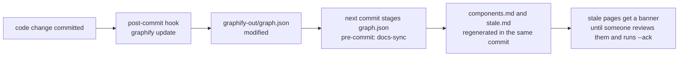

# Contributing to the docs

The docs are **docs-as-code**:

- Markdown lives in `docs/`, next to the code.
- Changes go through the same pull requests as the code.
- The site is built with [MkDocs Material](https://squidfunk.github.io/mkdocs-material/).

Three things keep the docs honest:

1. **Examples run.** Every result table on the site comes from running the code when the site is built, and `make test` runs every example too.
2. **Reference pages are generated.** The API comes from docstrings, the request schema from the pydantic models, and the error codes from scanning the source.
3. **The code graph flags drift.** Each page declares which source files it explains. When the code knowledge graph shows that one of those files has changed, the page is flagged until someone reviews it.

## Commands

```bash
make docs-serve    # live preview at http://127.0.0.1:8000
make docs-build    # strict build into site/: any warning, broken link or failing example is an error
make docs-sync     # regenerate the pages built from graphify-out/graph.json
make docs-check    # fail if those pages are out of date (CI runs this)
make graph         # rebuild the code graph, then run docs-sync
```

## Layout

```
docs/
  index.md                       landing page
  calc/
    getting-started/             tutorials: install, quick start, demo, curl
    concepts/                    explanation: architecture, evaluation order, numbers, formulas
    scenarios/                   one page per feature, each with a runnable finance example
    integrations/ operations/ qa/
    reference/                   API (mkdocstrings), request schema, error codes
    reference/generated/         written by scripts/docs_from_graph.py; never edit by hand
  examples/calc/
    book.py                      the twelve-position example book and table/curl helpers
    NN_<feature>.py              one runnable script per scenario page
    golden.py, golden_cases.json the QA golden cases
    test_examples.py             runs all of the above under pytest
  hooks.py                       MkDocs hooks: example imports, "may be out of date" banners
  .docs-sync.json                which version of the code each page was last reviewed against
scripts/docs_from_graph.py       the graph → docs sync
```

## Adding a feature page

1. **Write the example.** Add `docs/examples/calc/NN_<feature>.py`. Put the request in a top-level `REQUEST = {...}` literal, so the page can show it as JSON, and end with `print(table(result))`. Run it: `uv run python docs/examples/calc/NN_<feature>.py`.
2. **Write the page** in `docs/calc/scenarios/<feature>.md` from this template:

    ````markdown
    ---
    covers:
      - packages/calc/src/pylibs_calc/<the module this feature lives in>.py
    ---

    # Feature name

    !!! question "The business question"
        *"The question a trader or analyst would actually ask."*

    One paragraph: what the feature does.

    ## Try it

    === "Python"

        ```python
        ;--8<-- "NN_feature.py"
        ```

    === "JSON (curl)"

        ```python exec="on"
        from book import curl
        print(curl("NN_feature.py"))
        ```

    ## Result

    ```python exec="on"
    ;--8<-- "NN_feature.py"
    ```

    ## What to notice
    ## Gotchas
    ````

3. **Add it** to `nav` in `mkdocs.yml`, and to the table in `docs/calc/scenarios/index.md`.
4. **Mark it reviewed**: `uv run python scripts/docs_from_graph.py --ack docs/calc/scenarios/<feature>.md`.
5. Run `make docs-build` and `make test`.

## How the graph keeps the docs in step



- **`covers:`** in a page's front matter lists the source files the page explains.
- **The public surface** of a file is taken from the graph: its public classes, functions and methods, their docstrings, and the calls and imports it makes to other modules. Line numbers are ignored, so moving code around doesn't flag anything.
- **`docs/.docs-sync.json`** records each page's surface when it was last reviewed. When the current surface differs, the page is listed in [Docs freshness](calc/reference/generated/stale.md) with the symbols that were added and removed, and it gets a warning banner on the site.
- **After reviewing a page** (and updating it if needed), run `--ack` for it and commit `.docs-sync.json` with your change.
- **Coverage.** Docs freshness also lists every name in `pylibs_calc.__all__` that no page mentions.

The check is deliberately **advisory**. CI fails only when the *generated* pages are out of date with `graph.json`, not when a page needs review. Use `scripts/docs_from_graph.py --fail-on-stale` if you want the stricter behaviour.

!!! note "What the graph can't see"
    The graph captures the structure of the code, not every line of it. A change inside a function body that adds no calls, and edits no docstring, won't flag a page. The runnable examples and the golden cases cover that gap: if the behaviour changes, their output changes, and `make test` fails.

## Style

- **Lead with the business question**, and use the example book, so readers can compare pages.
- **Show real output.** Never paste a result table by hand; run the example.
- **Keep sentences short**, and use plain words. Many readers aren't Python developers.
- **Put the details that bite** (nulls, rounding, limits) under *Gotchas*.
